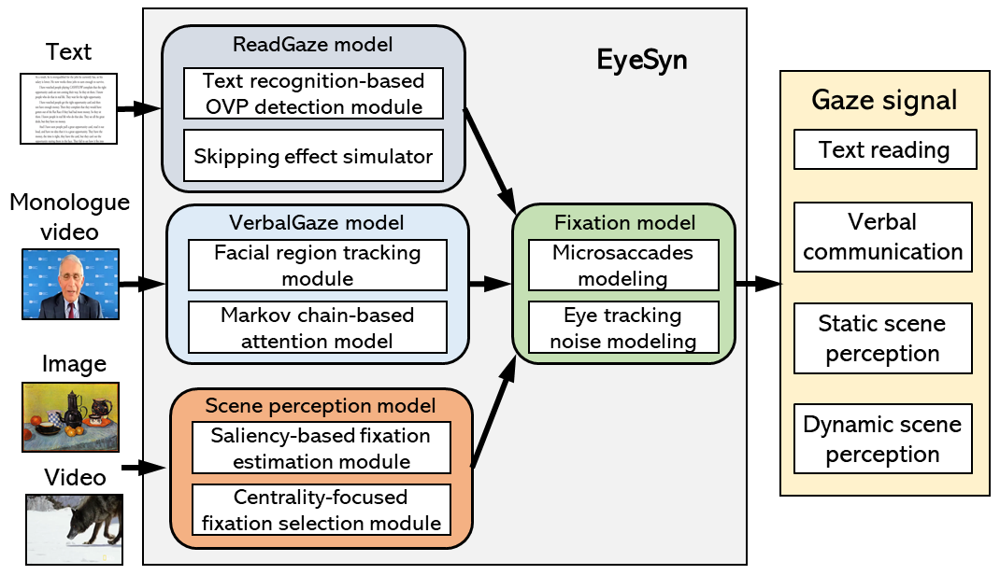
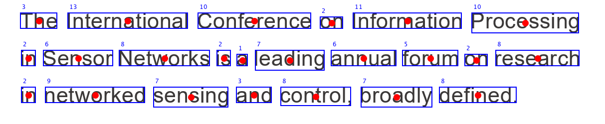
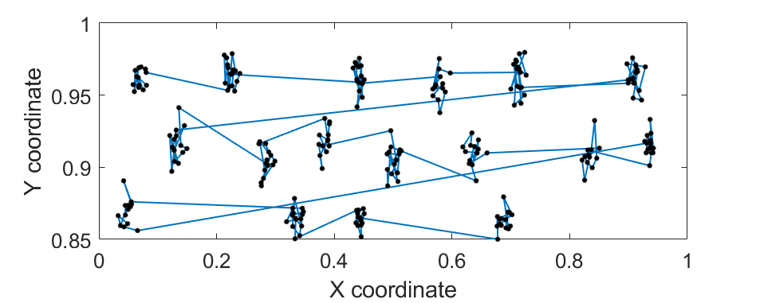

# Research Artifacts of EyeSyn
This repository contains the research artifacts for the **ACM/IEEE IPSN 2022** paper ["EyeSyn: Psychology-inspired Eye Movement Synthesis for Gaze-based Activity Recognition"](https://maria.gorlatova.com/wp-content/uploads/2022/03/EyeSyn_CR.pdf), including the implementation of the generative models and our own collected gaze dataset.

## **Outline**

* [Overview](#1)
* [Demo Video](#2)
* [Eye Movement Dataset](#3)
* [EyeSyn Implementation](#4)
* [Citation](#5)
* [Acknowledgments](#6)

The rest of the repository is organized as follows. [**Section 1**](#1) gives a brief overview of EyeSyn. [**Section 2**](#2) shows a short demo video of the gaze-based museum activity recognition. [**Section 3**](#3) introduces our own collected eye movement dataset. [**Section 4**](#4) brief introduces the implementation of the four generative models. The citation information, author contacts, and acknowledgements are introduced in [**Section 5**](#5) and [**Section 6**](#6). 


## 1. <span id="1"> Overview</span> 
<p align="center"></p>
<p align="center"><strong>Figure 1. Overview of EyeSyn design.</strong></p> 

EyeSyn is a comprehensive set of psychology-inspired generative models for eye movement synthesis. An overview of EyeSyn is shown in Figure 1. It takes publicly available images and videos as the inputs to synthesize realistic eye movements for four common categories of cognitive activity, including: *text reading*, *verbal communication*, and *static and dynamic scene perception*. EyeSyn incorporates three psychology-inspired generative models to synthesize the corresponding visual behaviors that would be captured by an eye tracker when a subject is performing the activity. Moreover, to generate realistic gaze signals, the fixation model is introduced to simulate gaze perturbations that result from both microsaccades and the measurement noise in eye tracking. 

EyeSyn opens up opportunities to generate realistic, large-scale eye movement datasets that can facilitate the training of gaze-based activity recognition applications, and eliminate the need for expensive and privacy-compromising data collection. Moreover, EyeSyn can also benefit applications that feature animated characters or avatars, such as video games, social conversational agents, and photo-realistic facial animation for virtual reality. The synthesized gaze signals can be used as the inputs of the avatar model to produce realistic eye movements for the facial animation. 

## 2. <span id="2"> Demo Video</span>

A short demo video of the gaze-based museum activity recognition is shown below. The demo is running on the [Magic Leap One](https://www.magicleap.com/en-us/magic-leap-1) AR headset. The system leverages the gaze signals captured by [the onboard eye tracker](https://developer.magicleap.com/en-us/learn/guides/design-eye-gaze) in Magic Leap One to continuously track the interactive activity the user is performing, i.e., reading the text descriptions of an exhibit or browsing the painting. Then, based on the recognized user context, they AR system adjusts the digital content that is rendered in the user's view to enhance her engagement and learning experience.

**Note: You can find the full demo video on YouTube by clicking the gif image below.**
[](https://youtu.be/s3GtVBg2JMg)


## 3. <span id="3"> VisualProcessingActivity Eye Movement Dataset</span>
### 3.1 Data Collection Setup

We collect a gaze dataset, denoted as *VisualProcessingActivity*. The study is approved by our institution's Institutional Review Board. Two different eye tracking devices, the [PupilLabs](https://pupil-labs.com/products/core/) and the [Magic Leap One](https://www.magicleap.com/en-us/magic-leap-1), are used in the data collection. Eight subjects (three female and five male, aged between 24 and 33) participate in the study: four subjects leverage the onboard eye tracker in the Magic Leap One, while the others use the Pupil Labs for eye movement collection. Both devices capture eye movements with the sampling frequency of 30Hz. Specifically, the subjects who are wearing the Pupil Labs are sitting in front of a 34-inch computer monitor at a distance of 50cm. The visual stimulus for each of the activities is displayed on the monitor. The resolution of the display is 800x600. We conduct the manufacturer's default on-screen five-points calibration for each of the subjects. For the Magic Leap One, the stimuli are rendered as virtual holograms placed on blank white walls around a room at head height. The holograms are with a size of 50cmx50cm in size, and their distances to the subjects are 1 to 1.5m. We perform the built-in visual calibration on the Magic Leap One for each of the subjects. 

### 3.2 Activities and Visual Stimuli used in Data Collection
For both devices, we ask the subjects to perform each of the four activities, i.e., *Read, Communicate, Browse, and Watch*, for five minutes. They can freely choose the stimuli that we have prepared:

- **Read**: we create three sets of text images from three digital reading materials that *differ in both text layout and font size*: a transcription of Richard Hamming’s talk on *“You and Your Research”* [1]; a chapter from the book *“Rich Dad Poor Dad”* [2]; and a chapter from the book *“Discrete Calculus”* [3]. Examples of the text images we used as the visual stimuli are shown below:

<p align="center">
     <table>
          <tr>
               <td>  
                    <p align="center">(a) Text image extracted from “You and YourResearch” </p>
               </td>
               <td>  
                    <p align="center">(b) Text image extracted from “Rich Dad Poor Dad” </p>
               </td>
               <td>  
                    <p align="center">(c) Text image extracted from “Discrete Calculus” </p>
               </td>
          </tr>
     </table>
</p>

</br>

- **Communicate**: seven monologue videos are prepared, including: three video clips extracted from *an online interview with Anthony Fauci* [[4]](https://www.youtube.com/watch?v=bkoip6-yeBE); two video clips extracted from *the ACM Turing Award Laureate interview with Raj Reddy* [[5]](https://www.youtube.com/watch?v=h99ryGYGnc0); and *two online YouTube videos* in which the speaker is giving advice on career development [[6]](https://www.youtube.com/playlist?list=PLnGTnWKBZrh8MvERPR_KgiANsrEmulzGO). All videos have only one speaker. Snapshots of the video stimuli are shown below:

<p align="center">
     <table>
          <tr>
               <td>  
                    <p align="center">(a) Video clip extracted from [4] </p>
               </td>
               <td>  
                    <p align="center">(b) Video clip extracted from [5] </p>
               </td>
               <td>  
                    <p align="center">(c) Video clip extracted from [6] </p>
               </td>
          </tr>
     </table>
</p>
</br>
  
 - **Browse**: we randomly select a subset of 200 images from the public available *''Best Artworks of All Time''* painting image dataset [[7]](https://www.kaggle.com/ikarus777/best-artworks-of-all-time) that contains 7,937 images of famous paintings. During the data collection, for each of the subjects, we randomly select 30 images from the subset and show each of the selected images to the subject for 10 seconds. Examples of the painting images used in the data collection are shown below:

<p align="center">
     <table>
          <tr>
               <td>  
                    <p align="center"></p>
               </td>
               <td>  
                    <p align="center"></p>
               </td>
               <td>  
                    <p align="center"></p>
               </td>
               <td>  
                    <p align="center"></p>
               </td>
          </tr>
     </table>
</p>
</br>

 - **Watch**: we randomly pick six short documentary videos from the online video series of the *"National Geographic Animals 101"* [[8]](https://www.youtube.com/playlist?list=PLaP7riDmeeBVAZOy_l1jrvJpPENNZYqts). Each video lasts for 5 to 6 minutes. Examples are shown below:

<p align="center">
     <table>
          <tr>
               <td>  
                    <p align="center"></p>
               </td>
               <td>  
                    <p align="center"></p>
               </td>
               <td>  
                    <p align="center"></p>
               </td>
          </tr>
     </table>
</p>
</br>

### 3.3 Download the Dataset

**Data Preprocessing:** we have applied basic data preprocessing to the collected eye movement data. Specifically, we first remove the corrupted gaze points by filtering any measurements with confidence level lower than 0.6 (the confidence level is the indicator used by both eye trackers to assess their confidenceon the correctness of the gaze measurements). Then, we apply a median filter with a sliding window of 90 samples to detect and filter the outliers in the measurements (i.e., gaze points that havea large Euclidean distance to the remaining samples in the sliding window). Lastly, we use spline interpolation to harmonize and resample the filtered gaze signal to its original length. The preprocessed dataset is available [**here**](https://github.com/EyeSyn/EyeSynResource/blob/main/dataset.zip). 

**The structure of the dataset:** the dataset follows a hierarchical file structure shown below:
```
Dataset
└───MagicLeap
│   │
│   └───Subject1
│       └───Browse
│           └───gaze_points.txt
│       └───Communicate
│           └───gaze_points.txt
│       └───Read
│           └───gaze_points.txt
│       └───Watch
│           └───gaze_points.txt
│   └───Subject2
│   └───Subject3
│   └───Subject4
└───PupilLab
│   │
│   └───Subject1
│       └───Browse
│           └───gaze_points.txt
│       └───Communicate
│           └───gaze_points.txt
│       └───Read
│           └───gaze_points.txt
│       └───Watch
│           └───gaze_points.txt
│   └───Subject2
│   └───Subject3
│   └───Subject4
```

Each of the *gaze_points.txt* files contains the gaze samples (a **9000 x 2** time series) collected from the subject when she/he is performing the corresponding activity. The **9000** corresponds to a **5 minutes (300 seconds)** gaze data sampled at **30Hz**, the **2** columns correspond to the **normalized X and Y coordinates of the gaze points**.


## 4. <span id="4"> EyeSyn Implementation</span>

We implement EyeSyn in MATLAB, and use it to construct a massive synthetic eye movement dataset, denoted as SynGaze. Specifically, we use the following image and video data as the inputs to simulate gaze signals for the four activities. **Note that**, to aviod potential copyright infringement, we will not share the extracted video clips and images that are used in the dataset generation. Instead, we will open-source our generative models and provide detailed examples of the synthesizing process, such that one can easily prepared his/her own inputs and use the models for eye movement synthesis.

### 4.1 ReadGaze Model
*The source code of ReadGaze model is available [**here**](https://github.com/EyeSyn/EyeSynResource/tree/main/readGazeModel)*.  Please refer to section 4.2 in the paper for details about the design. The ReadGaze Model containts the following scripts: 
```
readGazeCodes
└───mainText.m  ##The main script
└───ORCText.m   ##The script that leverages ORC text recognition to identify the optimal viewing positions in the input text image;  
└───readGazeMain.m   
└───fixationProByLength.m  ## Implementation of the skipping effect and fixation selection.
└───gazeSythesisOnFixOnText.m  ## Synthesis gaze points on the selected fixation positions.
```
You can run the script `mainText.m` directly and you should be able to generate the following results:

<p align="center"> </p>
<strong>Figure 2. Left: example of the detected optimal viewing positions on the input text image; Right: scatter plot of the synthesized gaze points.</strong></p> 

In the paper, we extract 100 text images from each of the three digital books, “*Rich Dad Poor Dad*” [2], “*Discrete Calculus*” [3], and the “*Adler’s Physiology of the Eye*” [9], as the inputs for gaze synthesis. The three books differ in both text layout and font size. 

### 4.2 VerbalGaze Model
*The source code of VerbalGaze model is available [**here**](https://github.com/EyeSyn/EyeSynResource/blob/main/verbalGazeModel/verbalGazeCodes.zip)*.  Please refer to section 4.2 in the paper for details about the design. The ReadGaze Model containts the following scripts: 
```
verbalGazeCodes
└───mainVerbalGaze.m  ##The main script
└───faceDetection.m   ##The script that leverages the Viola-Jones algorithm to track the eyes, nose, and mouth of the speaker as the potential fixation locations;  
└───mainTalkingWeighted.m  ## Implementation of the Markov chain-based attention model. 
└───fixationPD.m  ## Probability distribution of the fixation duration.
└───gazeSythesisOnFixation.m  ## Synthesis gaze points on the selected fixation positions.
```
You can run the script `mainVerbalGaze.m` directly for gaze synthesis. In the paper, we extract 100 monologue video clips from the online interview series of the “*ACM Turing Award Laureate interview*” [10] as the inputs of the **VerbalGaze model**. Each video clip lasts 5 to 7 minutes with a frame rate of 30fps. 

### 4.3 StaticScene Model
*The source code of StaticScene model with example will be made available [**here**]()*. 

- **Browse**: we leverage the public available *''Best Artworks of All Time''* painting image dataset [[7]](https://www.kaggle.com/ikarus777/best-artworks-of-all-time), which consists of 7,937 images of famous paintings, as the inputs of the **StaticScene model**. 

- **Watch**: we extract 50 short documentary videos from the online video series of the “*National Geographic Animals 101*” [[8]](https://www.youtube.com/playlist?list=PLaP7riDmeeBVAZOy_l1jrvJpPENNZYqts) as the inputs of the **DynamicScene model**. Each video lasts for 2 to 6 minutes. *The source code of DynamicScene model with example will be made available [**here**]()*. 

## 5. <span id="5">Citation</span>

Please cite the following paper in your publications if the codes or dataset helps your research.

     @inproceedings{Lan22EyeSyn,
      title={{EyeSyn}: Psychology-inspired eye movement synthesis for gaze-based activity recognition},
      author={Lan, Guohao and Scargill, Tim and Gorlatova, Maria},
      booktitle={Proceedings of the ACM/IEEE International Conference on Information Processing in Sensor Networks (IPSN)},
      year={2022}
    }


## 6. <span id="6">Acknowledgments</span>
We thank the study's participants for their time in the data collection. This study was done in the [Intelligent Interactive Internet of Things Lab](https://maria.gorlatova.com/) at [Duke University](https://www.duke.edu/), and was approved by our institution's Institutional Review Board.  

The authors of this repository are [Guohao Lan](https://guohao.netlify.com/), [Tim Scargill](https://sites.duke.edu/timscargill/), and [Maria Gorlatova](https://maria.gorlatova.com/). Contact Information of the authors: 
* Guohao Lan (g.lan AT tudelft.nl)
* Tim Scargill (timothyjames.scargill AT duke.edu)
* Maria Gorlatova (maria.gorlatova AT duke.edu)

This work was supported in part by NSF grants CSR-1903136 and CNS-1908051, NSF CAREER Award IIS-2046072, and an IBM Faculty Award.

## **References**

  <p>[1] J. F. Kaiser, "Richard hamming-you and your research," Simula Research Laboratory. Springer, Berlin, Heidelberg, 2010. 37-60.</p> 
  
  <p>[2]  R. T. Kiyosaki and Sharon L. Lechter, "Rich dad poor dad: What the rich teach their kids about money that the poor and the middle class do not!," Business Plus, 2001.</p>
  
  [3] L. J. Grady and J. R. Polimeni, "Discrete calculus: Applied analysis on graphs forcomputational science," Springer Science & Business Media, 2010.
  
  [4] "Interview video with Anthony Fauci - on changing science, long COVID, and political intrusion into health agencies," [Link to the YouTube video](https://www.youtube.com/watch?v=bkoip6-yeBE).

  [5] "Interview video with Dabbala Rajagopal (Raj) Reddy," [Link to the YouTube video](https://www.youtube.com/watch?v=h99ryGYGnc0).

  [6] "Videos on career and academic resource," [Link to the YouTube video playlist](https://www.youtube.com/playlist?list=PLnGTnWKBZrh8MvERPR_KgiANsrEmulzGO).

  [7] "Best artworks of all time image dataset," [Link to the dataset](https://www.kaggle.com/ikarus777/best-artworks-of-all-time).

  [8] "National geographic animals 101," [Link to the YouTube video playlist](https://www.youtube.com/playlist?list=PLaP7riDmeeBVAZOy_l1jrvJpPENNZYqts).
  
  [9] L. A. Levin, P. L. Kaufman, and A. Alm, “Adler’s physiology of the eye,” 2011.
  
  [10] "ACM A.M. Turing award laureate interviews," [Link to the YouTube video playlist](https://www.youtube.com/playlist?list=PLn0nrSd4xjjaSLBSzmno-3Ods6FJE9nlO).

